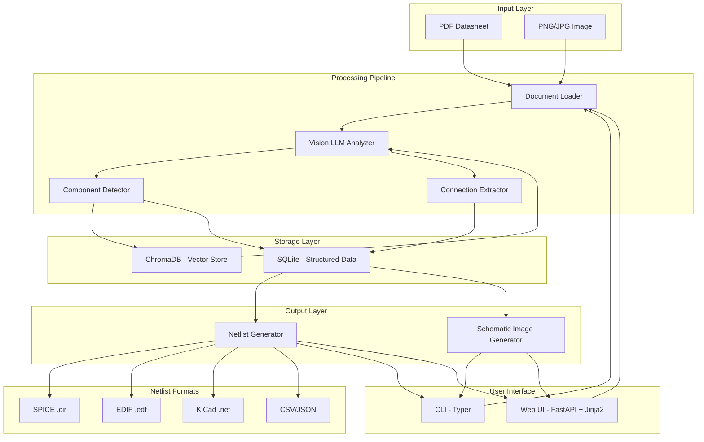
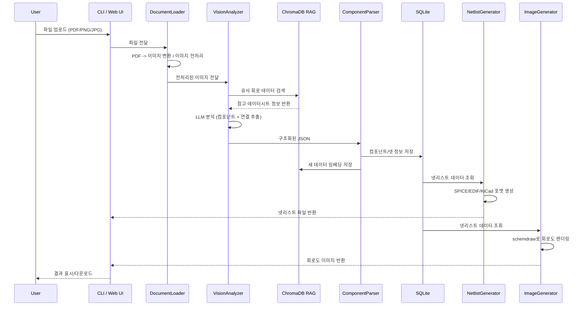

# Circuit Netlist Converter (회로 넷리스트 변환기)

## 전체 아키텍처




## 기술 스택

- **Python 3.11+**, 패키지 관리: **uv**
- **LLM**: Ollama (llama3.2-vision 11B, llava 등 로컬 비전 모델)
- **LangChain**: 문서 로딩, 체이닝, Ollama 연동
- **ChromaDB**: 벡터 DB (데이터시트 임베딩 저장, RAG 검색)
- **SQLite**: 구조화된 넷리스트/컴포넌트 데이터 저장
- **FastAPI + Jinja2**: Web UI
- **Typer**: CLI 인터페이스
- **Schemdraw / Graphviz**: 넷리스트 -> 회로도 이미지 변환
- **PyMuPDF (fitz)**: PDF 파싱/이미지 추출
- **Pillow**: 이미지 전처리

## 프로젝트 디렉토리 구조

```
c:\workspace\netlist/
├── pyproject.toml
├── README.md
├── .env.example
├── src/
│   └── netlist_converter/
│       ├── __init__.py
│       ├── main.py              # 진입점
│       ├── config.py            # 설정 관리 (Pydantic Settings)
│       ├── cli.py               # Typer CLI
│       ├── web/
│       │   ├── __init__.py
│       │   ├── app.py           # FastAPI 앱
│       │   ├── routes.py        # API 라우트
│       │   ├── templates/       # Jinja2 HTML 템플릿
│       │   └── static/          # CSS/JS
│       ├── core/
│       │   ├── __init__.py
│       │   ├── document_loader.py   # PDF/이미지 로딩
│       │   ├── vision_analyzer.py   # 비전 LLM으로 회로 분석
│       │   ├── component_parser.py  # 컴포넌트 인식/파싱
│       │   └── connection_parser.py # 연결 관계 추출
│       ├── models/
│       │   ├── __init__.py
│       │   ├── component.py     # Component 데이터 모델
│       │   ├── net.py           # Net/Connection 데이터 모델
│       │   └── netlist.py       # Netlist 통합 모델
│       ├── generators/
│       │   ├── __init__.py
│       │   ├── base.py          # 추상 Generator
│       │   ├── spice.py         # SPICE .cir 넷리스트 생성
│       │   ├── edif.py          # EDIF 2.0.0 넷리스트 생성
│       │   ├── kicad.py         # KiCad 넷리스트 생성
│       │   └── image.py         # 회로도 이미지 생성
│       ├── db/
│       │   ├── __init__.py
│       │   ├── vector_store.py  # ChromaDB 연동
│       │   ├── sqlite_store.py  # SQLite CRUD
│       │   └── models.py        # DB 테이블 모델
│       └── llm/
│           ├── __init__.py
│           ├── provider.py      # LLM Provider 추상화
│           ├── ollama_provider.py   # Ollama 로컬 LLM
│           └── cloud_provider.py    # 클라우드 LLM (옵셔널)
├── tests/
│   ├── __init__.py
│   ├── test_document_loader.py
│   ├── test_vision_analyzer.py
│   ├── test_generators.py
│   └── fixtures/               # 테스트용 샘플 파일
└── data/
    ├── uploads/                # 업로드된 파일
    ├── outputs/                # 생성된 넷리스트/이미지
    └── db/                     # SQLite/ChromaDB 데이터
```

## 핵심 설계 결정

### 1. LLM Provider 추상화

- `LLMProvider` 프로토콜(ABC)을 정의하여 Ollama/Cloud를 교체 가능하게 구현
- 기본값: Ollama (`llama3.2-vision`), 설정 파일로 전환 가능
- `config.py`에서 `LLM_PROVIDER=ollama|openai|anthropic` 환경변수로 제어

### 2. 회로 분석 파이프라인 (핵심 로직)

1. **Document Loading**: PyMuPDF로 PDF 페이지를 이미지로 변환, 직접 이미지는 Pillow로 전처리
2. **Vision Analysis**: 비전 LLM에 이미지 전달 -> 구조화된 JSON으로 컴포넌트/연결 추출
3. **RAG 보강**: ChromaDB에 저장된 기존 데이터시트 정보로 컴포넌트 스펙 보강
4. **Prompt 전략**: Few-shot 예시 + 체계적 프롬프트로 정확도 향상

### 3. 넷리스트 출력 포맷 (Zuken 호환)

- **SPICE (.cir)**: 범용 넷리스트 포맷 (대부분의 EDA 도구 호환)
- **EDIF 2.0.0 (.edf)**: Zuken CR-5000/CR-8000 직접 import 가능
- **KiCad (.net)**: 오픈소스 도구 호환
- **CSV/JSON**: 커스텀 import 용
- 어떤 Zuken 버전이든 최소 EDIF + SPICE로 커버 가능

### 4. DB 구조

- **ChromaDB**: 데이터시트 텍스트/이미지 임베딩 저장 -> 유사 회로 검색, 컴포넌트 스펙 RAG
- **SQLite**: 분석된 컴포넌트, 넷 연결 정보, 변환 이력 등 구조화 데이터

### 5. 회로도 이미지 생성

- `schemdraw` 라이브러리로 넷리스트 기반 회로도 SVG/PNG 렌더링
- PCB 수준에서는 컴포넌트 블록도 + 연결선으로 시각화

## 주요 의존성 (`pyproject.toml`)

```toml
[project]
dependencies = [
    "langchain>=0.3",
    "langchain-ollama>=0.3",
    "langchain-chroma>=0.2",
    "langchain-community>=0.3",
    "chromadb>=0.5",
    "fastapi>=0.115",
    "uvicorn>=0.34",
    "jinja2>=3.1",
    "typer>=0.15",
    "pydantic>=2.10",
    "pydantic-settings>=2.7",
    "pymupdf>=1.25",
    "pillow>=11.0",
    "schemdraw>=0.19",
    "spydrnet>=1.13",
    "aiosqlite>=0.20",
    "python-multipart>=0.0.18",
    "httpx>=0.28",
]
```

## 데이터 흐름 상세




## 사전 요구사항

- Python 3.11+
- uv 패키지 매니저
- Ollama 설치 + `llama3.2-vision` 모델 pull
- (선택) Graphviz 시스템 패키지

